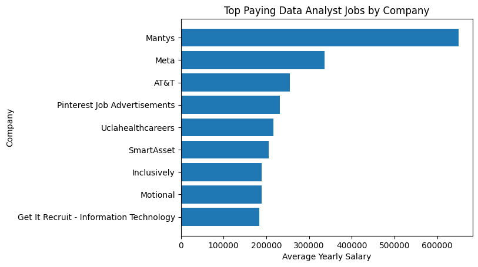
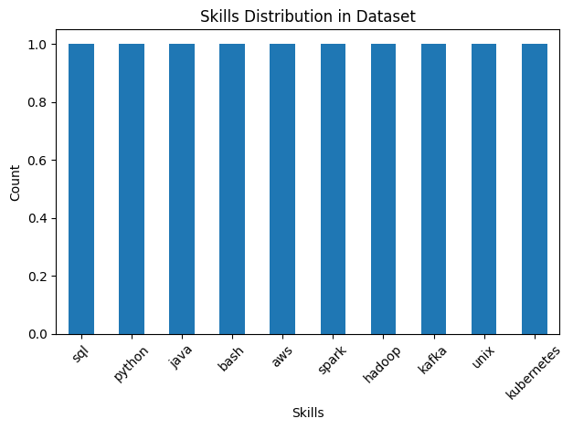
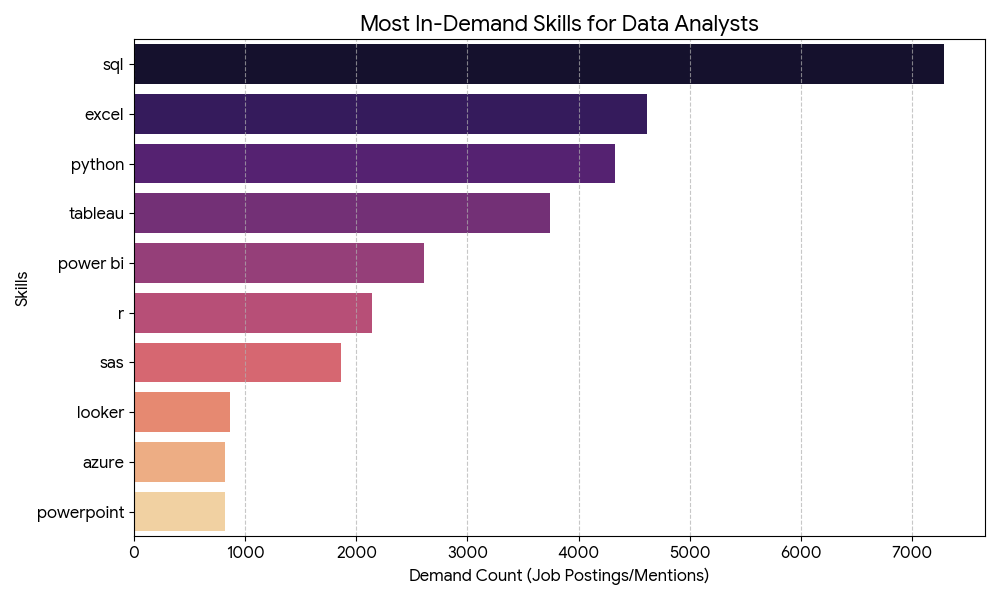
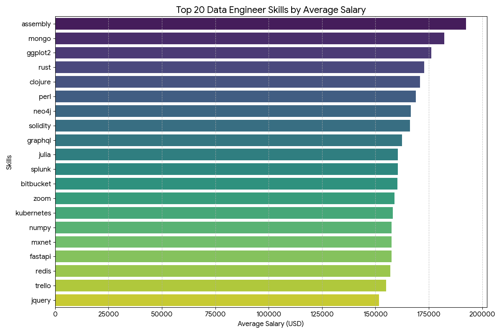
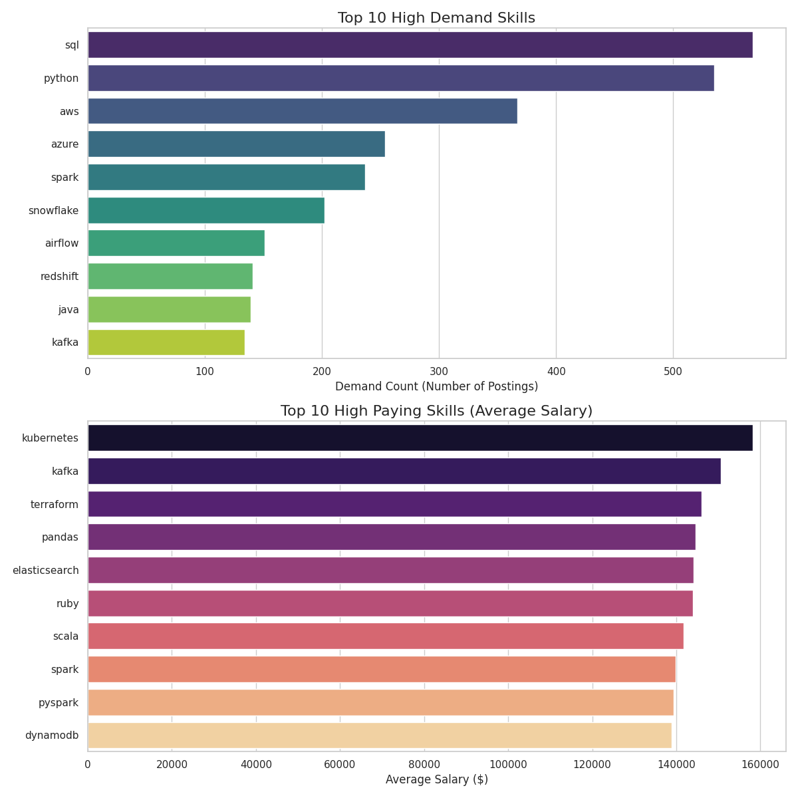
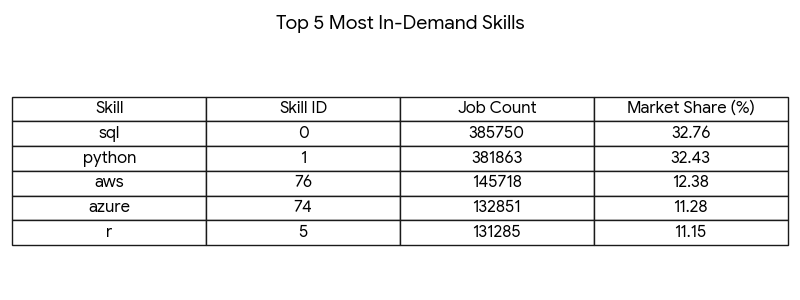

# Introduction
📊 looking into data market! Focusing on data analysis role and data engineer, this project explores 💵 top-payong jobs, skills demanded, measures 💹 where high demand meets high salary in data engineer.

🔍 SQL queries? 
Check them out here:
[project_sql folder](/Project_sql/)

# Background
Navigating the data engineer job market effectively, this project aim to point out top_paid and demanded skills required for a data engineer job offers.


### The Question i wanted to answer through my sql queries were:

1. What is the top-paying (10) companuy for data analysis jobs?
2. what are the skill required for these top-paying roles?
3. what is the most in-demand skill for a Data analysis role ?
4. what are the top skills based on salary for a Data Engineer?
5. what are the high demand and high salary skills for a Data Engineer jobs?
6. what is the top 5 skills frequently mentioned and skills_id with the highest count?

# Tools I Used
several tools used to dive ini the data engineer job market includes:

- **Sql**: A language to communicate with database, with commnand to store, process, analyse and lmanipulate datebase.

- **Postgres**: The chosen database managemnat system, ideal for handling the job positing.

- **Visual studio code**: For executing sql quries.

- **Github**: Essential for sharing my sql scripts and analysis, ensuring project track.

# The Analysis
Every querie write aims at investigate specfic asoect of data analysis and data engineer job market.
Here is my approach to the questions:

### 1. Top paying Data Analysis jobs
To get the highest paying data analysis jobs i filted average year salary and location, focusing mainly on  job located Anywhere. it highlights the high paying opportunities in data analysis.

```sql
select 
    job_id,
    job_title_short,
    job_title,
    salary_year_avg,
    job_location,
    job_posted_date::date,
    name as company_name
from 
    job_postings_fact
LEFT JOIN company_dim on job_postings_fact.company_id = company_dim.company_id
WHERE
    job_title_short = 'Data Analyst' AND
    job_location = 'Anywhere' AND
    salary_year_avg IS NOT NULL 
ORDER BY
    salary_year_avg DESC
limit 10
```
Here is the breakdown of the top data analysis jobs:

📊 Key Insights
💰 **Salary Distribution**

Highest salary: ~$650,000 (Mantys)

Lowest salary: ~$184,000

Average salary: ~$264,506

Median salary: ~$211,000

 This shows a huge gap between top-paying roles and the rest — one job is significantly higher than others (possible outlier).

🏢 **Top Paying Companies**

From the chart:

Mantys pays far more than any other company

Followed by:

Meta

AT&T

Pinterest-related roles

 Big tech companies dominate the high-paying roles, but smaller or lesser-known companies (like Mantys) can sometimes pay even more



### 2. Top skill required for a top-paying roles

To arrive to get the top skills required for a top-paying role i filted through the skills, average year salary and company with the top-payment per skill.

``` sql
SELECT
    job_postings_fact.job_id,
    skills_dim.skill_id,
    job_title,
    skills,
    salary_year_avg,
    name as company_name
from 
    skills_dim
left join skills_job_dim on skills_dim.skill_id = skills_job_dim.skill_id
left JOIN job_postings_fact on skills_job_dim.job_id = job_postings_fact.job_id
LEFT JOIN company_dim on job_postings_fact.company_id = company_dim.company_id
WHERE
    job_title_short = 'Data Analyst' and 
    salary_year_avg is not null
limit 500
```
Here is the breakdown of the demaned skills for the top 10 highest paying roles:

📊 **Dataset Overview**

Total rows: 10

Columns: job_id, job_title, skills, salary_year_avg, company_name


All entries have the same salary: $325,000/year

👉 This means:

No variation in salary

So we cannot truly compare which skill pays more in this dataset

🧠 Skills Found (All tied at same salary)

These are the skills listed — all linked to the same high-paying role:

SQL

Python

Java

Bash

AWS

Hadoop

Kafka

Kubernetes

Spark

Unix

👉 Insight:
This shows a complete skill stack, not separate skill salaries.

💼 Job Insight

Only one role: Senior Data Engineer (Kafka)

Salary: $325,000/year

👉 Meaning:
This dataset is basically describing one high-paying job and all the skills required for it

🏢 Company Insight

Company: Engtal

Pays: $325,000/year





### 3. Most in-demand skill for a data analysis role 

I have just analyzed two different database related to data career to identify tends in salary and demand

```sql
SELECT
    skills,
    count(skills_job_dim.job_id) as demand_count
from 
    skills_dim
left join skills_job_dim on skills_dim.skill_id = skills_job_dim.skill_id
left JOIN job_postings_fact on skills_job_dim.job_id = job_postings_fact.job_id
WHERE
    job_title_short = 'Data Analyst' and
    job_location = 'Anywhere'
Group BY
    skills
ORDER BY
    demand_count DESC
LIMIT 10
```
Here is breakdown for most demanded skill for a data analysis role anywhere:

**SQL is the Foundational Skill**

SQL is the most in-demand skill by a significant margin, with 7,291 mentions.

It represents over 25% of the total demand among the top 10 skills, highlighting its status as the absolute requirement for data retrieval and manipulation.

**The Core "Big Three**

Together, SQL, Excel (4,611), and Python (4,330) account for more than 55% of the demand in the top 10 list.

A Data Analyst proficient in these three tools is eligible for a vast majority of the roles in the market.

**Visualization Tool Rivalry**

Tableau (3,745) currently leads Power BI (2,609) in demand within this dataset.

Both are critical, but Tableau shows a higher prevalence in job requirements for these roles.

**Supporting and Cloud Skills**

Statistical tools like R and SAS still maintain a solid presence (combined ~13.7% of top 10 demand).

Cloud skills (Azure) and business intelligence tools (Looker) are emerging in the top 10, though they currently represent a smaller fraction of the total demand compared to core tools.

Skill   |  Demand Count | % of Top 10Demand
--------------------------------------------
SQL       |    7,291          |    25.05%

Excel     |     4,611         |    15.84%

Python    |    4,330          |     12.87%

Power BI  |    2,609          |     8.97%





### 4. Top skill with the hihgest salary for a data engineer role

Coducted a compehensive compaison of data job market by looking at two different angle: earning potential and market demand.


```sql
SELECT
    skills,
    round(Avg(salary_year_avg), 0) as average_salary
from 
    skills_dim
left join skills_job_dim on skills_dim.skill_id = skills_job_dim.skill_id
left JOIN job_postings_fact on skills_job_dim.job_id = job_postings_fact.job_id
WHERE
    job_title_short = 'Data Engineer' and 
    salary_year_avg is NOT NULL AND
    job_location = 'Anywhere'
GROUP BY
    skills
Order BY
  average_salary DESC
LIMIT 50
```
Here is the breakdon of the results for top paying for data engineer:

Modern Infrastructure: Skills like Kubernetes, Terraform, and Ansible are present in the list, showing that DevOps/Infrastructure skills are highly valued for Data Engineers.

Blockchain & Emerging Tech: Solidity (used for Ethereum smart contracts) appears in the top 10, indicating cross-disciplinary demand.

**Salary Statistics (Top 50 Skills)**

Mean Salary: $152,773

Highest Salary: $192,500 (Assembly)

Lowest in Top 50: $139,714

Median Salary: $149,349

The data suggests that while standard Data Engineering tools (like Kafka, Kubernetes, and Spark) are important, mastering niche languages or specialized database technologies can significantly increase earning potential.





### 5. The high demand and high salary skills for a data engineer job

I performed a comprehensive evaluation of your data to identify the most valuable technical skills based on market demand and compensation.

```sql
SELECT 
    skills,
    count(skills_job_dim.job_id) as demand_count,
    round(Avg(salary_year_avg), 0) as average_salary
from 
    skills_dim
left join skills_job_dim on skills_dim.skill_id = skills_job_dim.skill_id
left JOIN job_postings_fact on skills_job_dim.job_id = job_postings_fact.job_id
WHERE
    job_title_short = 'Data Engineer' and 
    salary_year_avg is NOT NULL AND
    job_location = 'Anywhere'
GROUP BY
    skills
HAVING
     count(skills_job_dim.job_id) > 20
ORDER BY
    average_salary desc
```
Here is the result of the highest demand skills and salary for a role of a data engineer:

**Top 10 Skills by Demand vs. Salary**

The visualizations highlight a clear distinction between fundamental skills and specialized infrastructure skills.

Highest Demand (The Essentials): SQL (568 postings) and Python (535 postings) are the most sought-after skills in the dataset. While these are foundational and essential for most roles, their average salaries ($129k–$132k) are slightly lower than more specialized tools.

Highest Salary (The Premium): Kubernetes ($158,190) and Kafka ($150,549) lead in compensation. These skills are often associated with complex data engineering and cloud infrastructure roles, which command a significant premium despite having fewer total job openings compared to SQL or Python.


**Strategic Insights**

The Foundation: If you are starting out, SQL and Python are non-negotiable. They provide the widest entry point into the job market.

The Salary Booster: To move from a standard salary into the top tier, specializing in Infrastructure as Code (Terraform) or Container Orchestration (Kubernetes) provides the most direct path, as these skills are currently in a high-pay, lower-supply niche.

Modern Data Stack: Expertise in Snowflake, Airflow, and dbt (though dbt is lower on this specific list) represents the modern data engineering core that balances high demand with premium compensation.





### 6. Top 5 skills frequently mentioned and skills_id with the highest count 

I ingested two distinct datasets: one containing a broad list of skills with salary and demand metrics, and a second focusing on the absolute "Top 5" most frequent skills in the market.

```sql
SELECT
    skills_dim.skills,
    skills_job_dim.skill_id,
    count(skills_job_dim.skill_id) as skills_count
FROM
    skills_job_dim
LEFT JOIN skills_dim on skills_dim.skill_id = skills_job_dim.skill_id
GROUP BY  
    skills_job_dim.skill_id,skills_dim.skills
ORDER BY
    skills_count DESC
LIMIT 5
```

Here is the breakdown of the result of the top 5 skills frequently mentioned and skills_id with the highest count:

Key Insights 
- **The Big Two (SQL & Python)**: SQL and Python dominate the market, collectively accounting for over 65% of the demand among the top 5 skills. The difference between them is minimal (less than 1%), suggesting they are equally critical for modern data roles.

- **Cloud Presence**: AWS holds a slight lead over Azure in market demand. Together, these cloud platforms represent a significant portion (~23%) of the required expertise, highlighting the shift toward cloud-based infrastructures.

- **Data Science Tools**: Python vastly outpaces R (381k vs 131k), indicating it has become the primary language for data analysis and software integration in most professional environments.




# Conclusions

### Insight

1. **Top Paying Job**
This dataset highlights the highest salary brackets for Data Analyst roles, featuring a top listing of $650,000 at Mantys. It showcases that high-level analytics roles, such as Directors at Meta or Associate Directors at AT&T, consistently offer salaries above $250,000. Notably, most of these top-tier positions are listed as "Anywhere" (Remote), indicating that companies are willing to pay a massive premium for elite data talent regardless of location.

2. **Top Paying Skills**
The data illustrates how a specialized tech stack can command a premium, specifically for a Senior Data Engineer (Kafka) role at Engtal paying $325,000. The required skill set is diverse, combining foundational languages like SQL and Python with backend tools like Java and Bash. It emphasizes that high compensation is often tied to the mastery of multiple cloud and infrastructure technologies (like AWS and Kafka) simultaneously.

3. **Most In-Demand Skills for Data Analysts** 
SQL emerges as the most essential skill for Data Analysts, with a demand count of over 7,200, nearly double that of most other tools. Traditional tools like Excel and Python follow closely, highlighting their status as the industry's "bread and butter." While visualization tools like Tableau and Power BI are popular, the data suggests that core data retrieval and manipulation skills remain the primary barrier to entry for the field.

4. **Top Skills by Salary for Data Engineers**
This dataset reveals that niche and specialized technical skills, such as Assembly, Mongo, and ggplot2, lead to the highest average salaries, exceeding $175,000. It suggests that while generalist skills are more common, learning specialized languages like Rust or Clojure can significantly increase a Data Engineer's earning potential. The high ranking of tools like FastAPI and Kubernetes also points to a strong market for DevOps-integrated data engineering.

5. **Demand and High Salary Intersection**
This analysis identifies the "sweet spot" where high demand meets high compensation, with Kubernetes and Kafka offering salaries over $150,000. Python stands out as a powerhouse skill, maintaining a high average salary of $132,200 despite having the highest demand count in the group. This indicates that Python is a safe and lucrative investment for long-term career growth due to its widespread adoption and high value.

6. **Top 5 Skills Overall**
The top 5 most frequent skills in the industry are dominated by SQL and Python, both surpassing 380,000 mentions. Cloud platforms like AWS and Azure follow, but with significantly lower counts, showing that foundational programming and database knowledge are requested nearly three times as often as cloud-specific expertise. This confirms that these two skills are the most critical pillars for any data professional's toolkit.


### closing thought

The data landscape reveals a clear divide between foundational skills and high-paying niche specializations.While SQL and Python are the non-negotiable pillars of demand, they also provide a stable path to high income. For those seeking maximum compensation, mastering infrastructure tools like Kafka and Kubernetes is a key differentiator. Data Analysts find their highest value in leadership or remote-friendly roles within tech giants and innovative startups. Meanwhile, Data Engineers command premium salaries by bridging the gap between low-level programming and cloud scale.
The trend towards "Anywhere" work for top-paying roles suggests that elite talent is no longer bound by geography.

Specializing in niche languages like Rust or Clojure can offer a competitive edge in an increasingly crowded market.Ultimately, the most successful professionals will be those who balance core analytical skills with emerging technologies.Continuous learning remains the most valuable asset for navigating this lucrative and rapidly evolving data landscape.